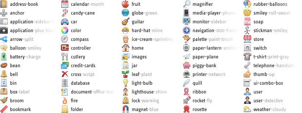
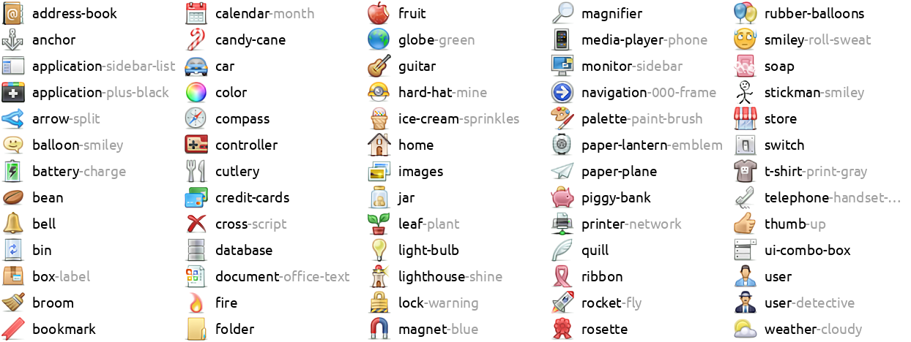

Fugue-2x icons
==============

This is a 2x upscaled version of the [Fugue icon set](https://p.yusukekamiyamane.com/),
by Yusuke Kamiyamane.

This repository contains 32x32 upscaled versions of all 16x16 Fugue icons. As such,
these icons are appropriate for use at small sizes on high-DPI displays, e.g. at a size
of 16x16 "logical" pixels with 2x scaling, equal to 32x32 physical pixels.

The Fugue icon set is licensed under a [creative-commons attribution
license](http://creativecommons.org/licenses/by/3.0/), and may be used with
[attribution](https://p.yusukekamiyamane.com/icons/attribution/) to the author. If you
do not wish to provide attribution, you may [purchase a
license](https://p.yusukekamiyamane.com/icons/license/).

The code in this repository is licensed under the MIT license - see
[`LICENSE-CODE.md`](LICENSE-CODE.md).

[Download icons](http://github.com/chrisjbillington/fugue-2x-icons/archive/master.zip)

[Preview all icons](https://github.com/chrisjbillington/fugue-2x-icons/raw/master/all.png) (9MB 6036x5346 png)

Comparison
----------

Sample of original Fugue icons:

[
  ](./mini-preview-orig.png)

Fugue-2x upscaled icons:

[
  ](./mini-preview-icons-2x.png)


Why?
----

Screens have a higher DPI now than they used to, but Fugue remains the most
comprehensive and consistent icon set, appropriate for use at small sizes in desktop
applications, that I know of. Whilst large svg icon sets exist, they are often not drawn
with the pixel-grid in mind causing blurriness when rendered at small sizes, or they are
monochrome and symbolic only, or they have an inappropriate level of detail for use at
small sizes, or they lack consistency.

Although Yusuke Kamiyamane hand-drew all Fugue icons originally at a 32x32 resolution,
he did so in a style that was optimised for how the icons would appear after downscaling
to 16x16 . As such there is a certain blockiness to these 32x32 icons (available as
photoshop files in the Fugue
[source](https://p.yusukekamiyamane.com/icons/downloads/fugue-icons-3.5.6-src.zip)) that
makes them less than ideal for use directly.

It turns out that with some trial-and-error, deep-learning-based upscaling software can
now be coaxed into producing quite good results for this icon set. So here we are.

Methodology
-----------

The icons were upscaled using `waifu2x`, a neural-network-based upsampler trained on
anime-style art.

This required some tricks.

Firstly, because `waifu2x` does not deal well with transparency, two versions of the
icons are upscaled, each with the transparent background replaced with a different solid
colour. After upscaling the two images, some pixel maths can be used to remove the
backgrounds and recover an upscaled image with correct transparency.

Secondly, `waifu2x` dealt much better with the icons when they were all placed together
in one large image. Perhaps this gives the neural network more context than each icon
individually, since they are all a similar style.

Thirdly, `waifu2x` didn't deal well with the tiny overlay icons used in icon variants.
These were instead added to the base icons after upscaling, using hand-tweaked versions
of the small overlay icons.

Rebuilding the icons
--------------------

If you just want to use the icons, they are already built and available as files in this
repository, so you don't need to rebuild them. This is just for reference.

The script used to upscale the icons from the original Fugue source is `upscale.py`. To
run it, you'll need the following requirements:

* Python with the `numpy` and `pillow` packages installed
* `waifu2x-ncnn-vulkan`
* `imagemagick`

Then run:

```bash
python upscale.py
```

Tested on Arch Linux with `waifu2x-ncnn-vulkan` version `20220728`, `imagemagick`
version`7.1.0` and Python `3.10.7`. This took seven minutes on my system.
